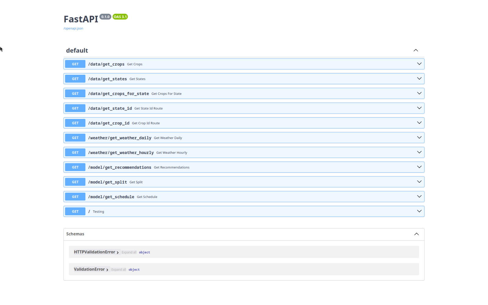
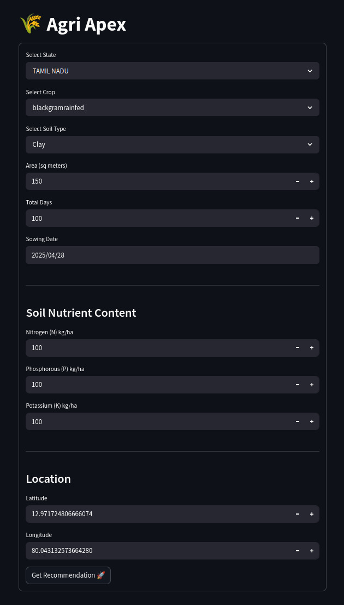

# 🌾 Agri Apex

Nothing interesting, just a last minute work for Core Course Project-II.


## Commands

To run the Server, use the command:
```bash
uvicorn server:app --reload
```

To run the Application, use the command:
```bash
streamlit run main.py
```


## Endpoint's and Port's

- Server Docs : [http://127.0.0.1:8000/docs#/](http://127.0.0.1:8000/docs#/)
- Application : [http://localhost:8501/](http://localhost:8501/)


## Pic's

Fucking shit of the UI!

- ### List of API's


- ### UI Structure

